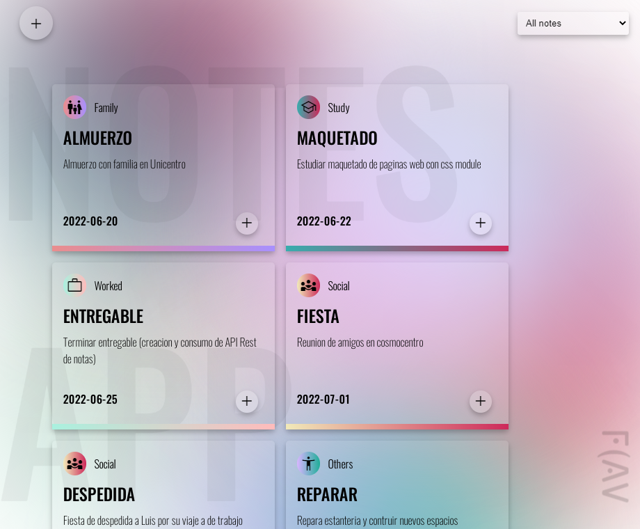
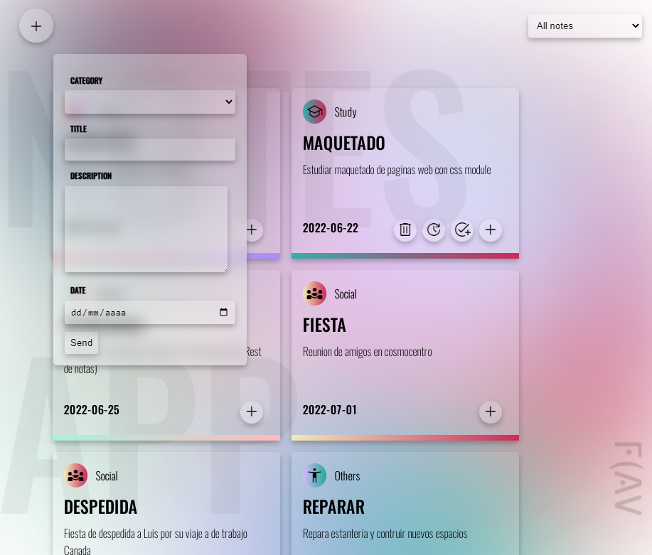

# Notes App

Con este proyecto se busca practicar el despliegue o consumo de información en el **Front-End** mediante un CRUD, haciendo uso de una rest-API creada en **Node JS**

Para esto se hace uso de **_React, CSS modules, React Hook Form, Axios, Node JS, Mongo DB_** con la finalidad de tener un proyecto con cierto nivel de dificultad y que además emplee algunas de las tecnologías más usadas en el desarrollo web.

[Proyecto desplegado en Netlify](https://flav-notesapp.netlify.app/)

Algunas carturas del proyecto

- Modo escritorio

